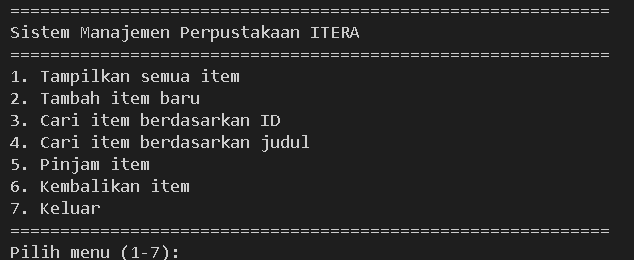
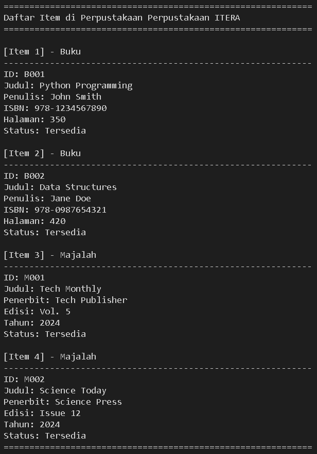
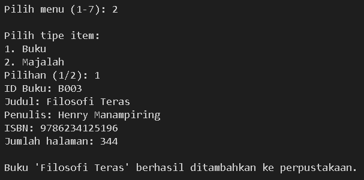
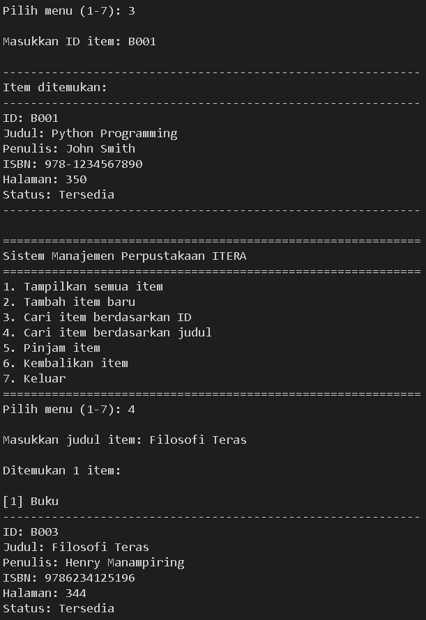
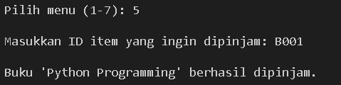
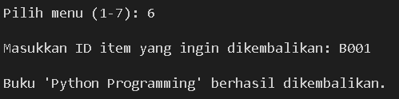

# Sistem Manajemen Perpustakaan
Program interaktif untuk mengelola koleksi buku dan majalah di perpustakaan menggunakan konsep Object-Oriented Programming (OOP) Python.

## Data Mahasiswa
- **Nama**: Muhammad Nurikhsan
- **NIM**: 123140057

---

## Deskripsi
Sistem manajemen perpustakaan berbasis console yang dibangun dengan menerapkan konsep OOP Python. Program ini memiliki menu interaktif untuk mengelola berbagai item perpustakaan seperti buku dan majalah, dengan fitur lengkap mulai dari penambahan, pencarian, hingga peminjaman item.

---

## Fitur Utama

### 1. Manajemen Item
- Tambah buku dengan informasi (ID, judul, penulis, ISBN, halaman)
- Tambah majalah dengan informasi (ID, judul, penerbit, edisi, tahun)
- Tampilkan semua item dalam perpustakaan
- Data awal otomatis terisi untuk demo

### 2. Pencarian Item
- Cari berdasarkan ID unik
- Cari berdasarkan judul (case-insensitive, partial match)
- Tampilkan hasil pencarian dengan detail lengkap

### 3. Sistem Peminjaman
- Pinjam item yang tersedia
- Kembalikan item yang dipinjam
- Status ketersediaan update otomatis
- Validasi item tersedia/dipinjam

### 4. Menu Interaktif
- Interface berbasis console yang user-friendly
- 7 menu pilihan untuk berbagai operasi
- Input validation untuk mencegah error
- Loop menu sampai user memilih keluar

---

## Konsep OOP yang Diimplementasikan

### 1. Abstract Class
```python
from abc import ABC, abstractmethod

class LibraryItem(ABC):
    @abstractmethod
    def display_info(self):
        pass
    
    @abstractmethod
    def get_type(self):
        pass
```
- LibraryItem sebagai abstract base class
- Memaksa subclass untuk implementasi method display_info() dan get_type()
- Tidak bisa diinstansiasi langsung
- Menggunakan module abc dari Python

### 2. Inheritance
```python
class Book(LibraryItem):
    def __init__(self, item_id, title, author, isbn, pages):
        super().__init__(item_id, title, author)
        self.__isbn = isbn
        self._pages = pages
```
- Book dan Magazine mewarisi dari LibraryItem
- Menggunakan super() untuk memanggil constructor parent
- Setiap subclass punya atribut tambahan spesifik
- Method abstract dari parent harus diimplementasi

### 3. Encapsulation
```python
class Library:
    def __init__(self, nama_perpustakaan):
        self.__items = []      # private
        self.__nama = nama_perpustakaan
    
    @property
    def nama(self):
        return self.__nama
```
- Protected attributes: single underscore (_item_id, _title)
- Private attributes: double underscore (__items, __isbn)
- Property decorator untuk controlled access
- Setter untuk validasi status peminjaman

### 4. Polymorphism
```python
for item in self.__items:
    item.display_info()  # Memanggil method sesuai tipe
```
- Method display_info() berbeda di Book dan Magazine
- Buku menampilkan ISBN dan halaman
- Majalah menampilkan edisi dan tahun
- Satu interface, implementasi berbeda

---

## Struktur Class

```
LibraryItem (Abstract)
├── Attributes:
│   ├── _item_id (protected)
│   ├── _title (protected)
│   ├── _author (protected)
│   └── _is_available (protected)
├── Properties:
│   ├── item_id (getter)
│   ├── title (getter)
│   ├── author (getter)
│   └── is_available (getter + setter)
└── Abstract Methods:
    ├── display_info()
    └── get_type()

Book (extends LibraryItem)
├── Attributes:
│   ├── __isbn (private)
│   └── _pages (protected)
└── Methods:
    ├── display_info() [implemented]
    └── get_type() [implemented]

Magazine (extends LibraryItem)
├── Attributes:
│   ├── _issue_number (protected)
│   └── _year (protected)
└── Methods:
    ├── display_info() [implemented]
    └── get_type() [implemented]

Library
├── Attributes:
│   ├── __items (private list)
│   └── __nama (private)
└── Methods:
    ├── tambah_item()
    ├── tampilkan_semua_item()
    ├── cari_by_id()
    ├── cari_by_judul()
    ├── pinjam_item()
    └── kembalikan_item()
```

---

## Cara Menjalankan

1. Clone repository
```bash
git clone https://github.com/username/repo-name.git
cd muhamamdnurikhsan_123140057_pertemuan5
```

2. Jalankan program
```bash
python main.py
```

3. Gunakan menu interaktif:
   - Pilih nomor menu (1-7)
   - Ikuti instruksi untuk setiap fitur
   - Ketik 7 untuk keluar dari program

---

## Menu Program

```
1. Tampilkan semua item
2. Tambah item baru (Buku/Majalah)
3. Cari item berdasarkan ID
4. Cari item berdasarkan judul
5. Pinjam item
6. Kembalikan item
7. Keluar
```

---

## Screenshot

### Menu Utama
Tampilan menu utama dengan 7 pilihan fitur



### Tampilkan Semua Item
Daftar semua buku dan majalah yang ada di perpustakaan



### Tambah Item Baru
Form untuk menambahkan buku atau majalah baru



### Pencarian Item
Hasil pencarian berdasarkan ID atau judul



### Sistem Peminjaman
Proses peminjaman item



### Sistem Pengembalian
Proses pengembalian item


---

## Penjelasan Kode

### Abstract Class LibraryItem
- Berfungsi sebagai template untuk semua item perpustakaan
- Mendefinisikan atribut dasar: ID, judul, penulis/penerbit, status
- Abstract method memaksa subclass implementasi display_info() dan get_type()
- Property decorator untuk encapsulation atribut

### Class Book dan Magazine
- Inherit dari LibraryItem dengan super().__init__()
- Book punya atribut tambahan: ISBN (private) dan pages
- Magazine punya atribut tambahan: issue_number dan year
- Implementasi display_info() berbeda sesuai jenis item
- Demonstrasi polymorphism yang jelas

### Class Library
- Mengelola koleksi dengan list private (__items)
- Private attribute __nama untuk nama perpustakaan
- Method CRUD untuk operasi perpustakaan
- Validasi pada peminjaman dan pengembalian
- Instance checking dengan isinstance()

### Menu Interaktif
- While loop untuk menu berulang
- Input validation untuk setiap pilihan
- Try-except implisit pada input integer
- Break untuk keluar dari loop

---

Praktikum Pemrograman Aplikasi Web
Institut Teknologi Sumatera